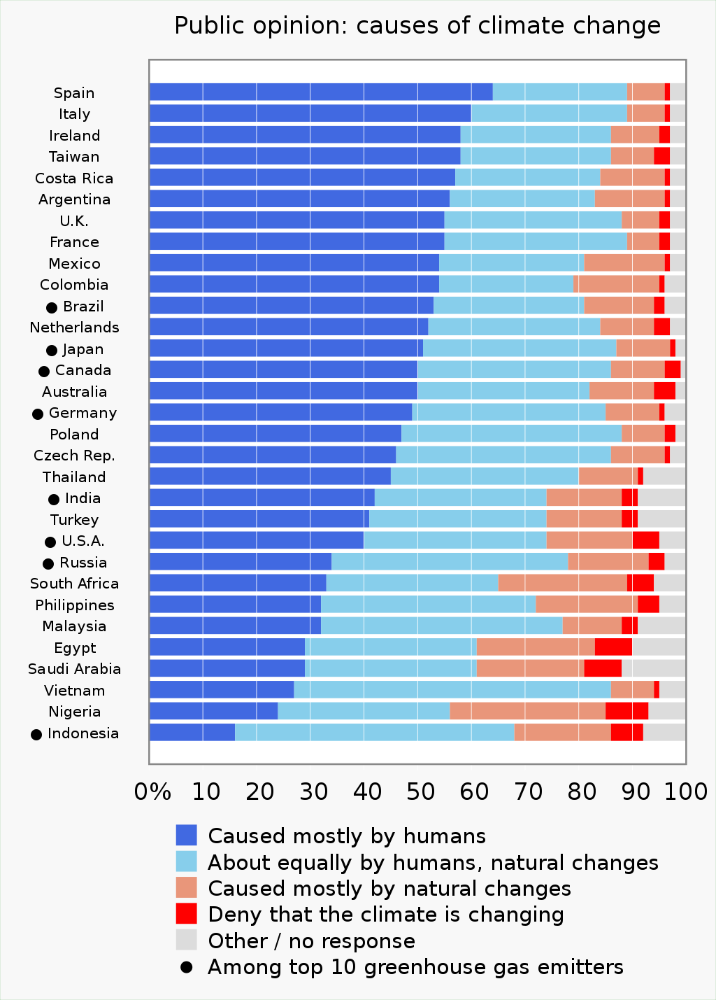

## Climate change is a global emergency !
### Public opinion on climate change: a barrier that is part of the solution
Nowadays, man-made climate change and global warming have become an emergency that goes far beyond national boundaries and certainly represents one of the **greatest challenges humankind has ever faced**. In fact, because of direct consequences like heat waves, more frequent and intense storms, rising sea levels, warming of the oceans and many others, humans, but most importantly animals, face new challenges for survival. In order to limit as much as possible the damages, **concrete actions need to be undertaken**. 
 
However, still **~30% of the worldwide population views climate change as a minor threat or not a threat at all** and do not consider the matter as an emergency[^1]. This constitutes a huge barrier in adressing climate change as changing the public opinion is needed to encourage climate-friendly behaviours. Therefore, changing public opinion may be a huge part of the solution but also one of the greatest challenges. This is why **identifying the factors that influence public views on climate change is a critical step** to urge politics to propose solutions on the matter and convince the population to act daily. Furthermore, **visibility of the topic in the media is crucial** to sensitize the population on the severity of the situation.

<figure class="center">
    
    <figcaption><a href="https://climatecommunication.yale.edu/wp-content/uploads/2021/06/international-climate-opinion-february-2021d.pdf"><em>Figure 1.</em></a> Yale Climate Connection-reported survey in 31 countries of public opinion on the causes of climate change. </figcaption>
</figure>

## How much is climate change mentioned in the news ?

## References

[^1]: [Pew research center, *A look at how people around the world view climate change*, 2019](https://www.pewresearch.org/fact-tank/2019/04/18/a-look-at-how-people-around-the-world-view-climate-change/)

