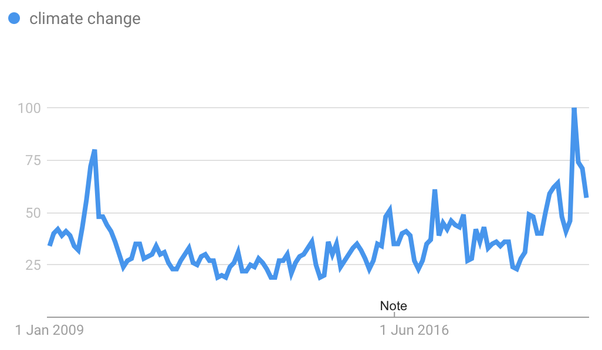
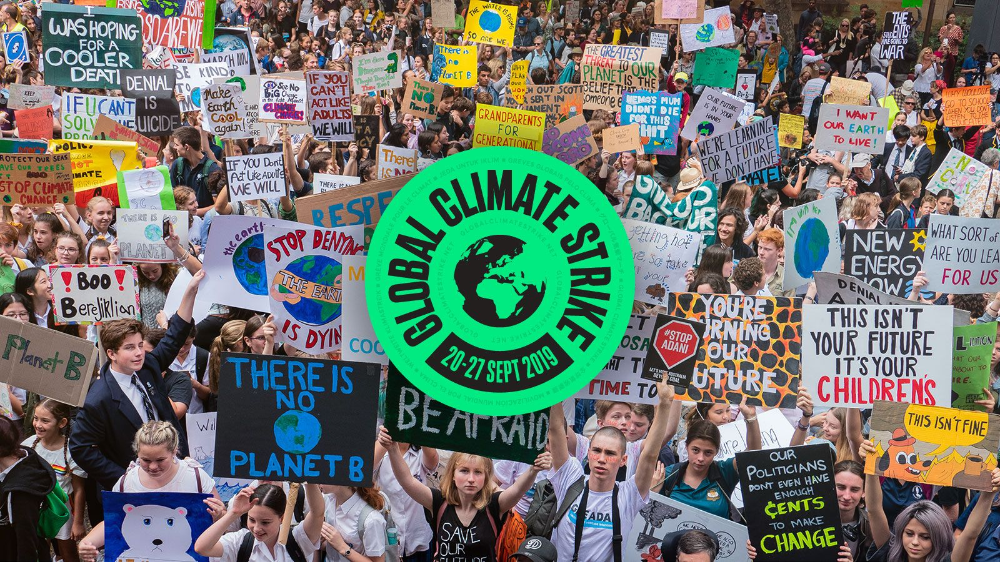

# Climate change is a global emergency !
### Public opinion on climate change: a barrier that is part of the solution
Nowadays, man-made climate change and global warming have become an emergency that goes far beyond national boundaries and certainly represents one of the **greatest challenges humankind has ever faced**. In fact, because of direct consequences like heat waves, more frequent and intense storms, rising sea levels, warming of the oceans and many others, humans, but most importantly animals, face new challenges for survival. In order to limit as much as possible the damages, **concrete actions need to be undertaken**. 

However, still **~30% of the worldwide population views climate change as a minor threat or not a threat at all** and do not consider the matter as an emergency[^1]. This constitutes a huge barrier in adressing climate change as shifting the public opinion is needed to encourage climate-friendly behaviours. Therefore, changing public opinion may be a huge part of the solution but also one of the greatest challenges. This is why **identifying the factors that influence public views on climate change is a critical step** to urge politics to propose solutions on the matter and convince the population to act daily. One of these influences certainly is the **media coverage of the topic** that sensitizes the population on the severity of the situation.

>Public opinion can be influential. The media can be influential.  _Noam Chomsky_

<figure class="center">
    
    <figcaption><a href="https://climatecommunication.yale.edu/wp-content/uploads/2021/06/international-climate-opinion-february-2021d.pdf"><em>Figure 1.</em></a> Yale Climate Connection-reported survey in 31 countries of public opinion on the causes of climate change. </figcaption>
</figure>

This data story explores the [QuoteBank dataset](https://zenodo.org/record/4277311#.YboGUC_pOPQ) to evaluate the occurence of the topic of climate change in the English news as well as its correlation with several parameters to better understand its influence on the population's interest on the matter. We pushed our analysis further by assessing the influence of the social context of the speakers (age, occupaction, political party, academic degree, nationality…) on the opinions on climate change using sentimental analysis.

# How much is climate change mentioned in the news ?
### An increased tendency through the years...
This question can seem quite obvious and simple to answer. However, to have a better idea on the importance the news give to the topic and the influence they have on the public opinion, we need to first find out how much climate change is mentioned and whether it correlates with the gravity of the situation.

To answer this question, we first sorted the quotes of the QuoteBank dataset in order to keep only the quotes related to climate change by **keyword search**. the following keywords were chosen by our wonderful team:
- Climate change
- Global warming
- Greenhouse effect
- Greenhouse gas
- Climate crisis
- Climate emergency
- Climate breakdown

We were then able to visualize the occurence of climate change-related quotes through the years, from 2008 to 2020:

<iframe frameborder="no" border="0" marginwidth="0" marginheight="0" width="100%" height="550" src="html/occurence_year.html"></iframe>

We can observe in this first plot an overall **increased tendency of quotes related to climate change through the years**. This result isn't a surprise for us as we hypothesize that the more the situation worsens, the more the news talk about it. We'll come back to this later.  
Interestingly, **the end of the year 2009 also shows a higher occurence**. Several hypothesis could explain that phenomenon:
- First, at that time, 2009 was tied for the **second warmest year in the modern record** by the NASA[^2], which could explain why global warming was a particularly hot topic during this time period. 
- It is also possible that the QuoteBank dataset contains more quotes from December 2009 than from other time periods, thereby yielding a bias.

### And through the months ?
An other interesting fact that one can observe from this plot is the **increase in the occurence of climate change-related quotes at the end of certain years**. Let's have a closer look at this:

<iframe frameborder="no" border="0" marginwidth="0" marginheight="0" width="100%" height="550" src="html/occurence_month.html"></iframe>

If we look more precisely at the plot above, there only is a significant increase at the end of the year in 2009 and 2015. This could be completely random or partialy explained by the arguments cited above in the case of 2009. Interestingly, **2015 belonged to the top 3 warmest years on record until 2019**[^3]. This could explain the peak in global warming-related quotes at the end of 2015. More generally, media coverage of climate change tends to increase at the end of the year while annual reports of global temperature anomalies and other data are published at that moment. We are therefore not surprised by these results.

<figure class="sidenote">
    
    <figcaption><a href="https://www.climatecentral.org/gallery/graphics/top-10-warmest-years-on-record"><em>Figure 2.</em></a> Top 10 hottest years until 2019.</figcaption>
</figure>

# The worst the situation gets, the more interest on the topic
### A correlation with the increase in global temperature ?
To understand whether the observed increase in climate related-quotes through the years is in fact due to the aggravation of the situation, we ploted the correlation between the monthly temperature anomaly (refering to the difference from the average, normal, temperature) and the monthly occurence of quotes mentioning climate change. To do so, we retrived the [HadCRUT5 dataset of global historical surface temperature anomalies](https://www.metoffice.gov.uk/hadobs/hadcrut5/data/current/download.html).

<iframe frameborder="no" border="0" marginwidth="0" marginheight="0" width="100%" height="550" src="html/correlation_temperature.html"></iframe>

Even if the correlation isn't significantly high, we can still observe a **positive correlation** with a R2 value of ~0.12 which stays consistent with the hypothesis that **the more the situation gets worse, the highest chance the news will talk about it**. Yet, this correlation isn't strong enough to conclude anything relevant. 

### The news talk about it, people google it

To evaluate the influence of the media on public opinion, we thought of comparing the [Google trends of climate change-related web searches](https://trends.google.fr/trends/explore?date=2009-01-01%202019-12-31&q=climate%20change) with the occurence of the quotes on the topic to assess whether media coverage could encourage people to get more informed on the subject.

<figure class="sidenote">
    
    <figcaption><a href="https://trends.google.fr/trends/explore?date=2009-01-01%202019-12-31&q=climate%20change"><em>Figure 3.</em></a> Google trend of climate change searches from 2009 to 2019.</figcaption>
</figure>

<iframe frameborder="no" border="0" marginwidth="0" marginheight="0" width="100%" height="550" src="html/correlation_google.html"></iframe>

Interestingly, we can observe a **significant correlation** with a R2 of ~0.61, meaning that people do **tend to get informed on subjects that the news cover**. Surprisingly, we can even notice that the highest web search trend corresponds to the highest climate change related-quote occurence, in September 2019. Did a particular event happened in September 2019 ? **Yes absolutely !** 
In fact, the **Global Week for Future**, which were a series of international strikes and protests to demand action be taken to address climate change, took place from 20–27 September 2019[^4]. This explains perfectly the boom in quotes occurence and google searches on the matter. We therefore have here a perfect example of public opinion influencing media coverage and media-coverage influencing public opinion.

<figure class="sidenote">
    
    <figcaption><em>Figure 4.</em>The Global Week for Future of September 2019.</figcaption>
</figure>

# Who talks about climate change ?
### A description of the most common speaker profile...
To see whether the social context influences the opinion on climate change, we first wanted to have a glance on who are the speakers talking the most about it on the English news without looking at the opinion on the matter. To do so, we decided to work with **5 main characteristics**:

- **Age of the speaker**
- **Occupation (job)**
- **Political party (in the USA)**
- **Academic degree**
- **Nationality**

These informations about speakers where provided to us by our teaching assitants who extracted them from the [Wikidata knowledge base](https://www.wikidata.org/wiki/Wikidata:Main_Page).
We first simply plotted the top 10 quotes' occurencies covering the climate change topic based on the characteristics of their corresponding speaker.

<iframe frameborder="no" border="0" marginwidth="0" marginheight="0" width="100%" height="550" src="html/speaker_characteristics.html"></iframe>

We can observe that quotes related to climate change are said most frequently by the following speaker profile:
- **Age:** *50-70*
- **Occupation:** *Politician*
- **Political party:** *Democratic*
- **Academic degree:** *Bachelor of Arts or Juris doctor*
- **Nationality:** *USA*

This can be explained by the fact that, first, QuoteBank is a corpus of English newspapers meaning that **the USA represent the majority of speakers here**. Secondly, people that tend the most to be quoted on news are **politicians**. We don't know about you, but in our case we do not know a lot of politicians younger than 50 years old or older than 70. Finally, the dominant party in the USA is the **Democratic party** and it is therefore not surprising that most quotes belong to democratic politicians. 
It is important to emphasise here that these results **do not indicate the proportion of climate-related quotes among all cited quotes** but rather show what is the most frequent profile of Quotebank speakers in the subset of climate change-related quotes. We therefore need to plot the proportion of climate related-quotes among all cited quotes by the speaker to really get relevant results in analysing the influence of social context on the interest on climate change.

### Quotes on climate change VS the rest of them

# The influence of social context on opinions of climate change: a sentiment analysis
### Why sentiment analysis ? 
When trying to understand the feelings or opinions that underlie a text or quote, **sentiment analysis** directly comes to mind. To analyse whether the speakers' characteristics mentioned above could influence the opinions on climate change, we decided to use a pre-trained model from hugginface which was run on all the quotes that clasifies quotes as **positive or negative**. For example the following quotes are good examples of what positive or negative means:

- *"No challenge poses a greater threat to future generations than climate change"* - Barack Obama --> negative
- *"Who can stop climate ? We can. You and you and you, and me."* - Desmond Tutu --> positive

We therefore ploted the percentage of positive versus negative quotes for the top 10 occurencies for each characteristic. 

<iframe frameborder="no" border="0" marginwidth="0" marginheight="0" width="100%" height="550" src="html/sentimental_analysis.html"></iframe>

Let's summarize whether we can conclude anything on the influence of the speaker's characteristics on climate change opinion:

- **Age:** younger speakers seem to be more negative about climate change than older speakers (not enough speakers between 80-100 to have a relevant information). This isn't very surprising to us as younger people are more aware of the gravity of the situation than older people in general.
- **Occupation:** Politician and diplomats have higher positive points of view about climate, mostly because they are smooth speakers and also because they do not seem to see climate change as threathening as journalists for example. 
- **Political party:** As expected, democrats are more positive than republicans about climat change.
- **Academic degree:** People with a bachelor of science seem to be more negative about climate change as well as people with a Master of Business administration. This could be explained by the fact that these speakers have more knowledge on the topic and are more aware of the matter. However, it seems difficult here to conclude any significant influence of Academic degree on opinion on climate change.
- **Nationality:** South Korea seems to have a more significant positive point of view about climat change compared to other countries. This could make sense while South Koreans tend to be indirect in their communication style[^5]. 

# References

[^1]: [Pew research center, *A look at how people around the world view climate change*, 2019](https://www.pewresearch.org/fact-tank/2019/04/18/a-look-at-how-people-around-the-world-view-climate-change/)

[^2]: [NASA earth science news, *2009: Second warmest year on record; end of warmest decade*, 2010](https://climate.nasa.gov/news/249/2009-second-warmest-year-on-record-end-of-warmest-decade/)

[^3]: [Climate central, *Top 10 warmest years on record*, 2019](https://www.climatecentral.org/gallery/graphics/top-10-warmest-years-on-record)

[^4]: [The Guardian, *Climate crisis: 6 million people join latest wave of global protests*, 2019](https://www.theguardian.com/environment/2019/sep/27/climate-crisis-6-million-people-join-latest-wave-of-worldwide-protests)

[^5]: [Cultural atlas, *South Korean culture - Communication*, 2021](https://culturalatlas.sbs.com.au/south-korean-culture/south-korean-culture-communication)
